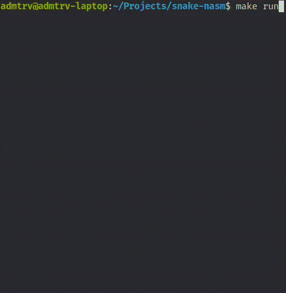

# Snake in NASM

Small terminal Snake written in NASM for Linux x86\_64. No libc, only syscalls. Renders with ASCII and ANSI escape codes.

<p align="center">
  
</p>

## Requirements

* Linux x86\_64
* NASM
* GNU ld
* make

```bash
sudo apt update
sudo apt install -y nasm make binutils
```

## Build and Run

The project includes a ready Makefile with these targets:

* `make` / `make all` - build the binary
* `make run` - build and run
* `make clean` - remove objects and the binary

Usage:

```bash
make run
```

## Gameplay Mechanics

* Controls: `wasd` keys control direction (cannot reverse into body), `q` to quit
* Field: 30x15 grid with borders
* Boundaries: Snake wraps around all screen edges (no walls)
* Food system: Random placement only on empty cells, grows snake on consumption
* Win condition: Fill entire field (450 cells total)
* Loss condition: Snake head collision with own body segments
* Tick rate: ~150 ms per frame
